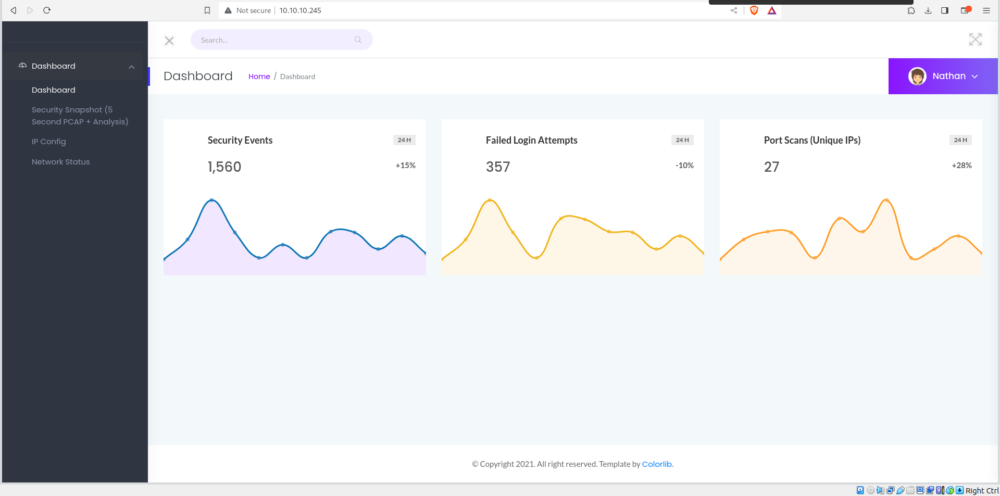
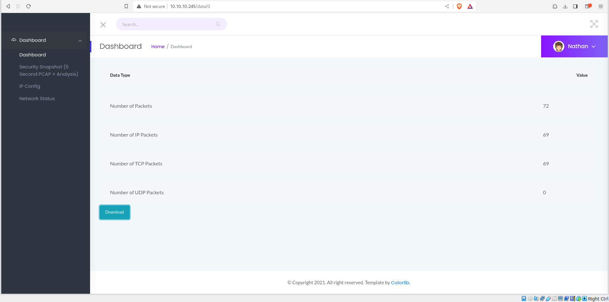
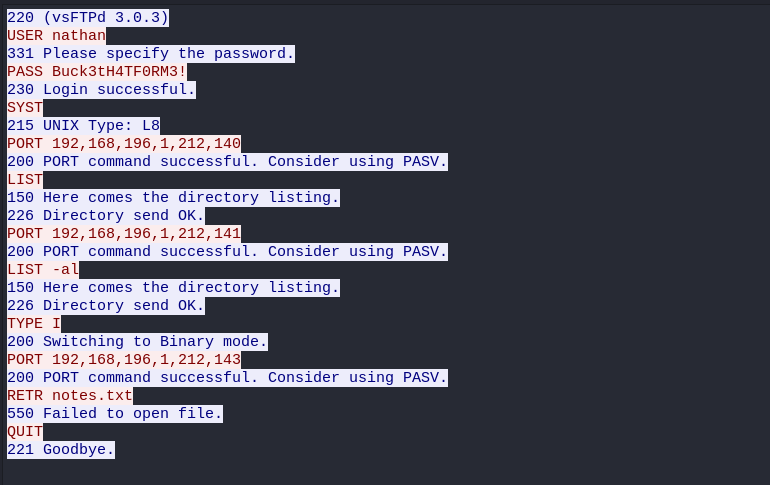
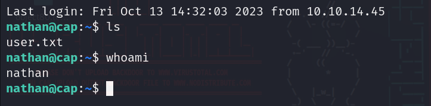
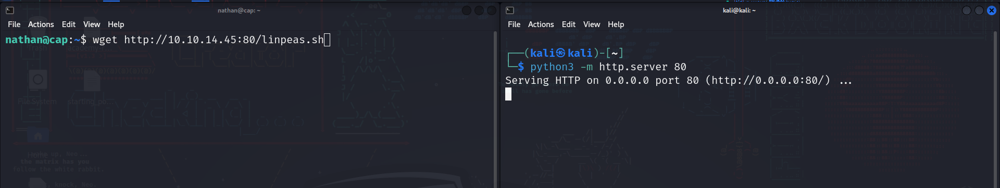
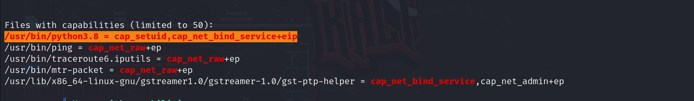
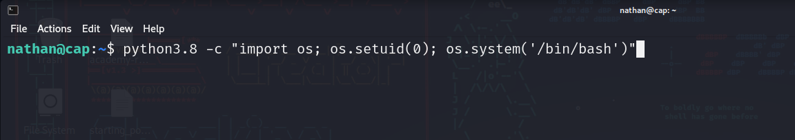
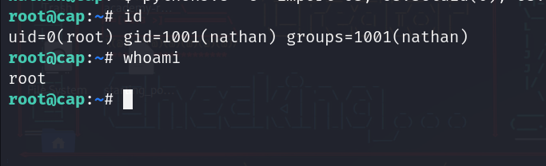

# Cap machine on [hackthebox](https://app.hackthebox.com/)

Written by: Mustafa Musallati.

### Enumeration
nmap scan:

```
Starting Nmap 7.94 ( https://nmap.org ) at 2023-10-13 09:43 EDT
Nmap scan report for 10.10.10.245
Host is up (0.084s latency).
Not shown: 997 closed tcp ports (reset)
PORT   STATE SERVICE VERSION
21/tcp open  ftp     vsftpd 3.0.3
22/tcp open  ssh     OpenSSH 8.2p1 Ubuntu 4ubuntu0.2 (Ubuntu Linux; protocol 2.0)
80/tcp open  http    gunicorn
```

Let's check the website :



We have some sort of security dashboard...


found paths: 
```
data
ip  
netstat
capture
```

### Exploitation
We can navigate through some pages and appearantly the data page shows us a packet capture based on the id (which is just a number), the format is like this:
`http://10.10.10.245/data/ID`

If we navigate through them we can see different captures, which means we can see captures for other users too, so let's try to see the 0 id capture:


We have some packets, let's download them and try to read some information.




Reading a little bit through, we can see some credentials for nathan user.

These credentials worked for ftp and ssh so no we have user:



If we check what can we do with sudo, we get nothing, however let's run linpeas and see what can it find for us:



After running it, we see that there is something interesting here:



The python binary on the machine has a capability of using setuid, after searching and reading about it we see that we can use it to give our user root privileges, here the link to a good article that explains it.

Article: [Link.](https://www.hackingarticles.in/linux-privilege-escalation-using-capabilities/)

So we will do the following command:



And the result:



As you can see we granted our user the root id (root privileges), and got full access.


thanks for reading!

Good hunting!! :)

---

Written by: Mustafa Musallati.
[LinkedIn](https://www.linkedin.com/in/mustafa-musallati-95a159260/)
[instagram](https://www.instagram.com/accaard/)


